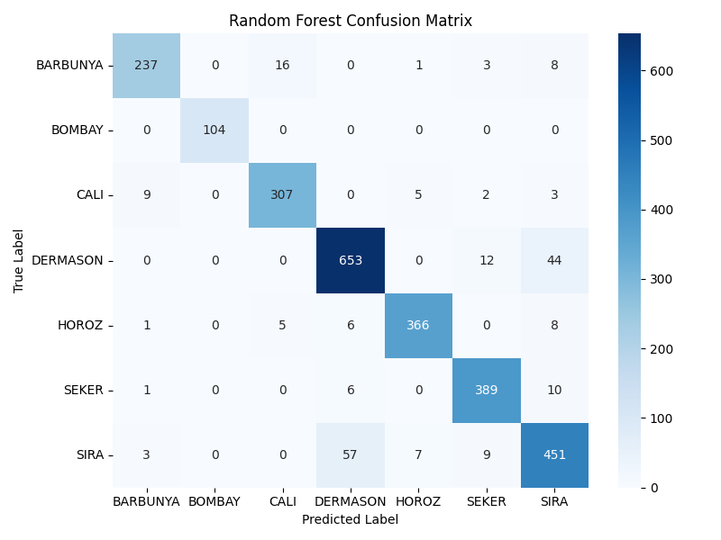

# 🫘 Dry Bean Classification ML Project

A complete machine learning workflow for classifying dry bean types using the UCI Dry Bean Dataset.

---

## 🚀 Quick Start

1. **Clone this repo:**
    ```bash
    git clone https://github.com/AMINEAKH/dry_bean_ml_project.git
    cd dry_bean_ml_project
    ```

2. **Install requirements:**
    ```bash
    pip install -r requirements.txt
    ```

3. **Add the dataset:**  
   Download [`Dry_Bean_Dataset.xlsx`](https://archive.ics.uci.edu/dataset/602/dry+bean+dataset)  
   and place it in the `data/` folder.

4. **Run the code:**
    - For step-by-step explanations and plots:
      ```bash
      jupyter notebook notebooks/dry_bean_classification.ipynb
      ```
    - To run everything as a script:
      ```bash
      python main.py
      ```

5. **Check your results:**  
   - Trained models: `models/`  
   - Evaluation reports: `results/classification_reports/`  
   - Confusion matrix images: `results/confusion_matrices/`  
   - Accuracy summary: `results/accuracy_scores.csv`

---

## 🖼️ Sample Result

Below is a sample confusion matrix for the Random Forest classifier on the test set:



*Random Forest confusion matrix on test data.*

---

## 🧑‍💻 Author

**Amine Akh**  
[AMINEAKH on GitHub](https://github.com/AMINEAKH)

---

## 📄 License

This project is licensed under the [MIT License](LICENSE).  
Free for academic, commercial, or personal use — just give credit!

---

## 📑 References

- [UCI Dry Bean Dataset](https://archive.ics.uci.edu/dataset/602/dry+bean+dataset)
- scikit-learn, pandas, matplotlib, seaborn

---

*Give this repo a ⭐ if you found it helpful!*
